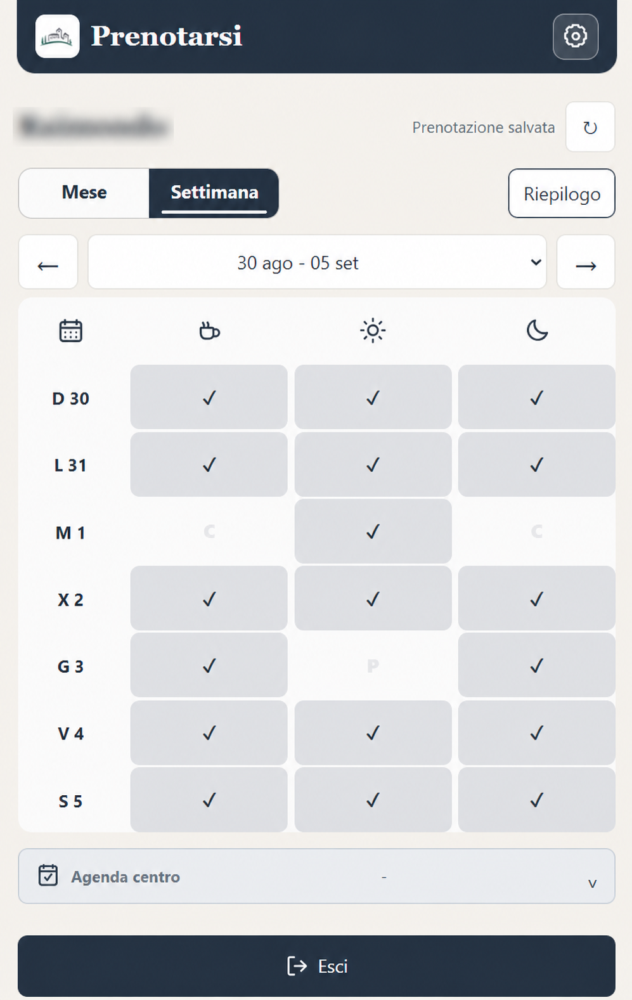
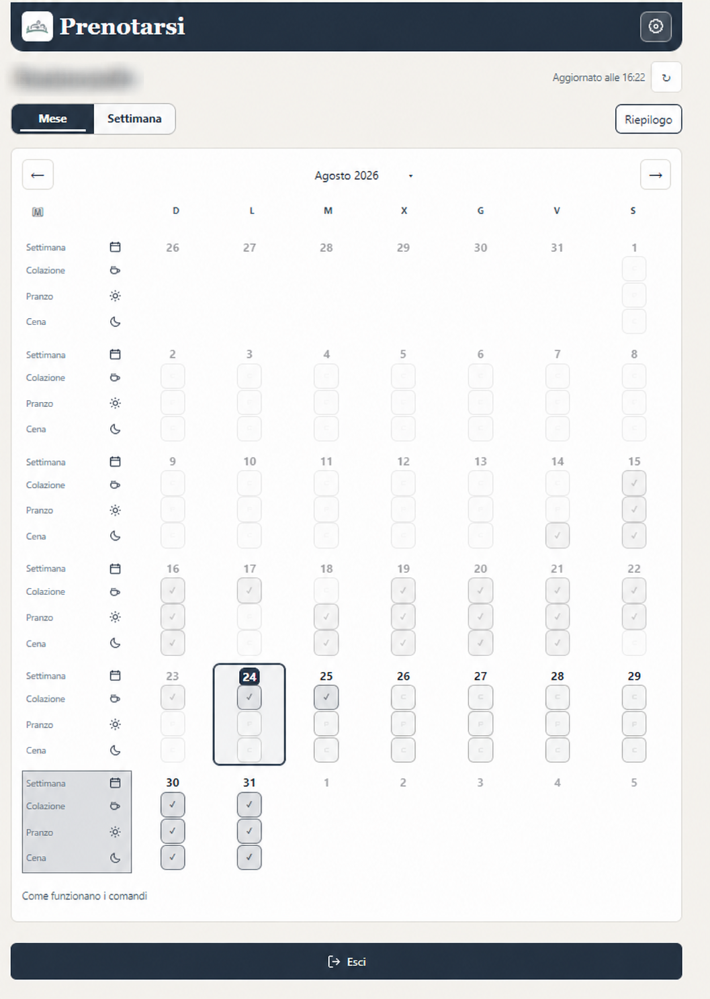
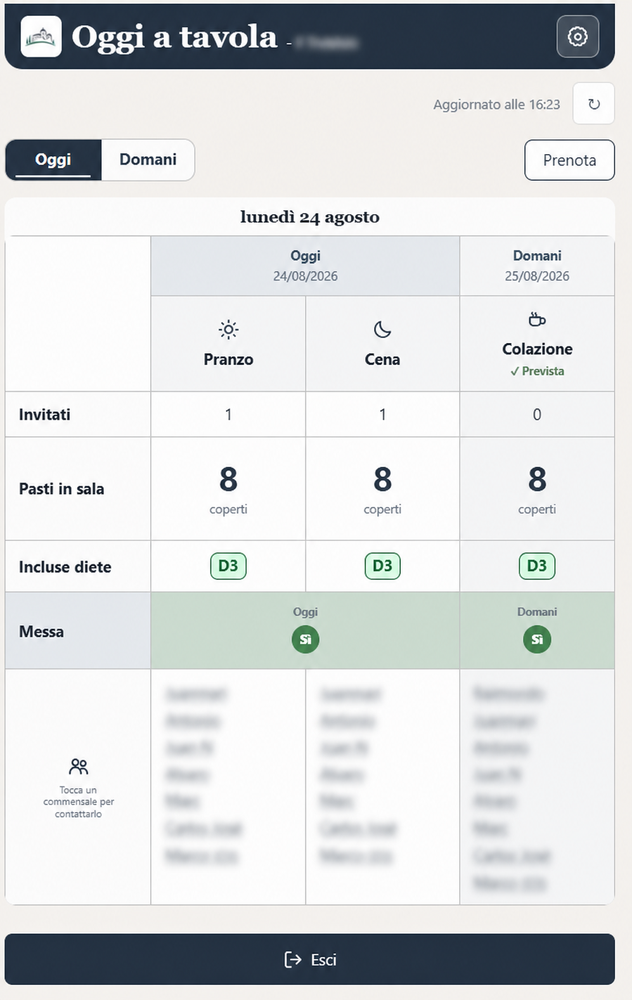
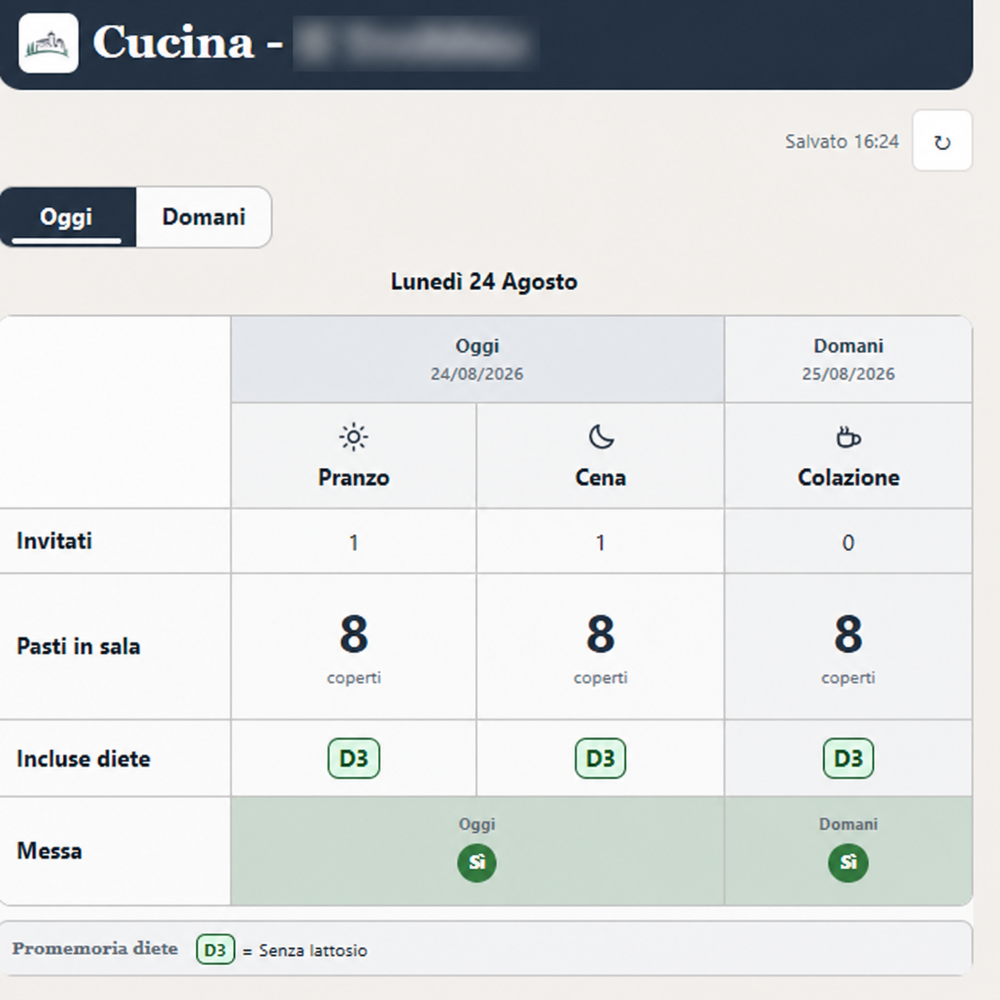
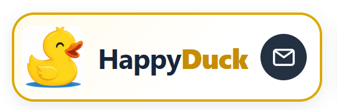

# Oggi a tavola

🇮🇹 [](README.md) 🇬🇧 [](README.en.md) 🇪🇸 [](README.es.md)

**Oggi a tavola** es una aplicación web instalable pensada para organizar las reservas de comidas en una comunidad residencial.

[Abrir la aplicación](https://tavola-comune.web.app) · [Comunicar un problema](mailto:rasanfil@gmail.com) · [Documentación técnica](docs/es/ARQUITECTURA_Y_SEGURIDAD.md)

## Qué permite hacer

- reservar desayuno, almuerzo y cena en las vistas mensual y semanal;
- aplicar selecciones múltiples a un día, una comida, una semana o al mes completo;
- consultar un resumen operativo sin modificar las reservas;
- mostrar a la cocina comensales, dietas, celebraciones y notas del día;
- gestionar personas, roles, horarios límite, calendario y enlaces operativos;
- instalar la PWA en Android y Windows sin publicarla en una tienda;
- mantener sesiones persistentes de residentes sin confundirlas con la autenticación administrativa.

La aplicación está diseñada para varios centros, pero cada dato y cada sesión permanecen asociados a su propio centro.

## La aplicación en imágenes

### Reservas

<table>
  <tr>
    <td align="center"><br><sub>Vista semanal</sub></td>
    <td align="center"><br><sub>Vista mensual</sub></td>
  </tr>
</table>

### Resumen y cocina

<table>
  <tr>
    <td align="center"><br><sub>Resumen operativo</sub></td>
    <td align="center"><br><sub>Vista de cocina</sub></td>
  </tr>
</table>

## Accesos y responsabilidades

| Perfil | Acceso | Funciones principales |
| --- | --- | --- |
| Residente | Código personal y contraseña común | Reservas y preferencias del dispositivo |
| Viceadministrador | Código personal y contraseña de administradores | Personas, enlaces operativos y funciones delegadas |
| Administrador | Google o correo verificado y contraseña | Control completo, configuración, gestión operativa y traspaso del cargo |
| Cocina | Enlace operativo del centro | Datos de cocina, sin el registro completo de residentes |

Cada centro tiene un único administrador. El traspaso del cargo sustituye al administrador actual por el nuevo; no crea un perfil separado llamado «responsable del centro».

El rol litúrgico es independiente del rol administrativo y también puede asignarse a un residente.

## Configuración predeterminada

| Ajuste | Valor inicial |
| --- | --- |
| Vista de apertura | Mes |
| Aspecto gráfico | Esencial |
| Paleta de colores | Tinta |
| Vista de resumen | Original |
| Vista de cocina | Original |
| Residentes en el resumen | Nombre |
| Controles múltiples de mes y semana | A la derecha |
| Idioma | Italiano |
| Recordatorios de reservas | Desactivados en cada dispositivo nuevo |
| Título inicial | Oggi a tavola |
| Segunda línea | Per prenotarsi sempre in tempo! |

Las preferencias personales se guardan en el dispositivo; los ajustes del centro se guardan en Firestore según los permisos del rol.

## Arquitectura resumida

La solución utiliza únicamente servicios compatibles con el plan gratuito Firebase Spark:

- Firebase Hosting para la PWA estática;
- Cloud Firestore para la configuración y los datos operativos;
- Firebase Authentication para administradores e identidades técnicas;
- un service worker que utiliza la red como fuente principal y la caché de la aplicación como alternativa;
- ninguna Cloud Function y ningún Cloud Storage.

El frontend es JavaScript modular sin framework. Las reglas de Firestore constituyen el segundo nivel de autorización y no dependen únicamente de la visibilidad de los controles en la interfaz.

Para más detalles: [Arquitectura, autenticación y seguridad](docs/es/ARQUITECTURA_Y_SEGURIDAD.md).

## Inicio local

Requisitos: Node.js `24.12.0`, npm y PowerShell 7 en Windows.

```powershell
git clone https://github.com/rasanfil-source/tavoliere.git
cd tavoliere
npm install
pwsh.exe -NoLogo -NoProfile -Command "node tools/dev-server.mjs"
```

Abrir después `http://127.0.0.1:4180`.

No incluir en las pruebas automatizadas credenciales reales, enlaces operativos activos ni copias de los datos del centro.

## Pruebas y build

```powershell
pwsh.exe -NoLogo -NoProfile -Command "npm test"
pwsh.exe -NoLogo -NoProfile -Command "npm run emulate:firebase-rules"
pwsh.exe -NoLogo -NoProfile -Command "npm run build"
```

Antes de una publicación, utilizar el proceso completo descrito en [Desarrollo y pruebas](docs/es/DESARROLLO_Y_PRUEBAS.md). Las reglas de Firestore deben comprobarse con los emuladores antes de publicarse.

## Documentación

- [Guía de uso](docs/es/GUIA_DE_USO.md)
- [Arquitectura, autenticación y seguridad](docs/es/ARQUITECTURA_Y_SEGURIDAD.md)
- [Desarrollo y pruebas](docs/es/DESARROLLO_Y_PRUEBAS.md)
- [Operaciones, publicación y recuperación](docs/es/OPERACIONES.md)
- [Cómo contribuir](CONTRIBUTING.es.md)
- [Avisos de seguridad](SECURITY.es.md)

## Soporte

<p align="center">
  <a href="mailto:rasanfil@gmail.com"></a><br>
  <a href="mailto:rasanfil@gmail.com">Escribe al desarrollador</a>
</p>

Proyecto **Oggi a tavola 2026**.
