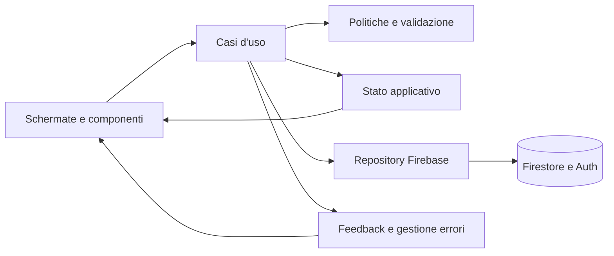

# Architettura target e migrazione progressiva

## Obiettivo

La riscrittura mantiene operativi dati, collegamenti e viste esistenti mentre sposta ogni responsabilita verso un modulo con un solo compito. Nessun modulo nuovo puo accedere direttamente al DOM e a Firestore nello stesso tempo.

## Architettura funzionale



### Livelli

1. **Schermate e componenti**
   - mostrano dati gia preparati;
   - raccolgono intenzioni dell'utente;
   - non costruiscono query Firestore;
   - non decidono autorizzazioni.

2. **Casi d'uso**
   - coordinano un'azione completa;
   - applicano permessi e validazione;
   - governano caricamento, successo, errore, annullamento e ripresa;
   - aggiornano lo stato soltanto dopo una risposta coerente del repository.

3. **Politiche e validazione**
   - contengono ruoli, scadenze, stati effettivi, dieta e vincoli dei profili;
   - sono moduli puri, senza DOM e senza Firebase;
   - sono coperti da test unitari esaustivi.

4. **Stato applicativo**
   - espone sezioni indipendenti per sessione, centro, persone, calendario e operativita;
   - ogni modifica passa da azioni nominate;
   - associa una revisione alle operazioni asincrone per ignorare risposte ormai superate.

5. **Repository Firebase**
   - costituiscono l'unico punto di lettura e scrittura remota;
   - restituiscono oggetti di dominio, non snapshot Firebase;
   - usano transazioni per successione e modifiche concorrenti;
   - invalidano in modo esplicito le cache interessate.

6. **Feedback e resilienza**
   - traduce gli errori tecnici in messaggi utili;
   - conserva i dati inseriti dopo un errore;
   - distingue offline, autorizzazione, conflitto e dato non piu attuale;
   - impedisce doppi invii senza rendere immobile l'intera pagina.

## Architettura delle schermate

### Piattaforma

- elenco dei centri;
- stato del centro e relativo Responsabile;
- generazione dell'invito per un nuovo Responsabile;
- nessun dato operativo dei singoli centri nella vista principale.

### Centro

- panoramica;
- persone;
- ruoli e accessi;
- collegamenti operativi;
- configurazione e copertura del calendario;
- esportazione e registro essenziale.

### Area operativa

- prenotazioni mese;
- prenotazioni settimana;
- Oggi a tavola;
- cucina;
- ammalati, diete occasionali, note cucina e Messe per i ruoli autorizzati.

La navigazione mostrera prima le operazioni frequenti. Le sezioni di configurazione resteranno raggiungibili, ma non occuperanno il flusso quotidiano.

## Struttura del codice

```text
public/
  core/
    state-store.mjs
    operation-guard.mjs
    result.mjs
  domain/
    roles.mjs
    participants.mjs
    reservations.mjs
    diets.mjs
    calendar.mjs
    ownership.mjs
  firebase/
    auth-repository.js
    center-repository.js
    participant-repository.js
    role-repository.js
    reservation-repository.js
    operations-repository.js
  use-cases/
    access/
    centers/
    participants/
    roles/
    reservations/
    operations/
  ui/
    components/
    screens/
    navigation/
    feedback/
```

I nomi descrivono la destinazione finale. Durante la migrazione i moduli esistenti restano attivi dietro adattatori fino alla sostituzione completa del relativo flusso.

## Stato applicativo

```js
{
  session: {
    phase: 'signedOut | authenticating | ready | error',
    userId: '',
    centerId: '',
    role: '',
    capabilities: []
  },
  center: {
    phase: 'idle | loading | ready | saving | error',
    value: null,
    revision: 0
  },
  people: {
    phase: 'idle | loading | ready | saving | error',
    items: [],
    selectedId: '',
    drafts: {},
    revision: 0
  },
  calendar: {
    phase: 'idle | loading | ready | saving | error',
    period: null,
    days: [],
    pendingKeys: [],
    revision: 0
  },
  operations: {
    phase: 'idle | loading | ready | saving | error',
    day: null,
    health: null,
    note: null,
    masses: [],
    revision: 0
  },
  feedback: {
    messages: []
  }
}
```

### Regole dello stato

- Le schermate leggono uno snapshot; non modificano direttamente gli oggetti.
- Ogni azione asincrona riceve un identificativo e una revisione.
- Una risposta riferita a una revisione vecchia non sovrascrive dati piu recenti.
- I moduli conservano l'ultimo dato valido durante una difficolta di rete.
- Le bozze dei moduli restano separate dai dati confermati.

## Fonti autorevoli

| Dato | Unico punto di modifica target |
|---|---|
| Ruolo e capacita | `domain/roles.mjs` e `firebase/role-repository.js` |
| Profilo persona e dieta permanente | `use-cases/participants/save-participant.mjs` |
| Sospensione e ripristino | `use-cases/participants/change-participant-status.mjs` |
| Eliminazione definitiva | `use-cases/participants/delete-participant.mjs` |
| Prenotazione effettiva | `domain/reservations.mjs` |
| Scadenze | `domain/calendar.mjs` |
| Dieta occasionale e ammalati | `use-cases/operations/save-daily-health.mjs` |
| Messe | `use-cases/operations/save-mass.mjs` |
| Configurazione centro | `use-cases/centers/save-center-settings.mjs` |
| Collegamenti | `use-cases/centers/manage-operational-links.mjs` |
| Successione OWNER | `use-cases/roles/transfer-ownership.mjs` |

## Evoluzione dei dati Firebase

I percorsi esistenti `centers/{centerId}/...` restano validi. La migrazione aggiunge soltanto campi o collezioni compatibili.

### Dati introdotti

- `centers/{centerId}/auditEvents/{eventId}`
  - `action`, `actorUid`, `targetType`, `targetId`, `summary`, `createdAt`;
- `centers/{centerId}/privateSettings/operationalLinks`
  - identificativi dei collegamenti Residenti e Cucina attualmente validi;
- `centers/{centerId}/privateSettings/calendarReconfiguration`
  - operazione riprendibile che riallinea le scadenze delle finestre future senza modificarne lo stato;
- ruolo `ADMIN` negli inviti e nei profili amministrativi;
- `ownerUid` nel documento del centro come riferimento autorevole del Responsabile.

Il trasferimento del Responsabile non usa documenti intermedi: un solo batch cambia `ownerUid`, promuove il successore, assegna al precedente Responsabile il ruolo `ADMIN`, aggiorna i due profili e registra l'evento. Le regole rifiutano ogni aggiornamento parziale.

La revisione dei documenti modificabili da piu amministratori e `schemaVersion` restano evoluzioni previste per i moduli che richiederanno un controllo di concorrenza persistente.

Il registro non conserva password, sigle di accesso o contenuti sanitari dettagliati.

## Strategia di migrazione

### M0 - Baseline

- blocco dei comportamenti esistenti tramite test;
- esportazione di sicurezza prima di ogni migrazione dati;
- nessuna rimozione di campi.

### M1 - Fondamenta compatibili

- politica ruoli pura;
- validatori puri;
- store e guardia delle operazioni;
- adattatori sopra i moduli Firebase attuali.

### M2 - Accesso e centro

- nuova sessione applicativa;
- separazione Piattaforma/Centro;
- repository per centro, ruoli e inviti;
- vecchi URL mantenuti tramite risoluzione compatibile.

### M3 - Persone e ruoli

- editor unico della persona;
- sospensione, ripristino ed eliminazione come casi d'uso distinti;
- inviti `ADMIN` e `MANAGER`;
- trasferimento OWNER transazionale;
- registro essenziale e immutabile delle modifiche amministrative;
- inizializzazione di `revision` alla prima modifica concorrente utile.

### M4 - Collegamenti e operativita

- panoramica del centro costruita sui dati gia caricati;
- directory delle persone separata dall'unico editor autorevole;
- collegamenti separati dalla preparazione calendario, con copia e rotazione controllata;
- ciclo visibile degli inviti con stato, scadenza e revoca;
- scadenze configurabili con avanzamento riprendibile e registro dell'operazione;
- repository delle prenotazioni;
- nuova settimana operativa;
- stato coerente tra mese, settimana, riepilogo e cucina.

### M5 - Chiusura

- verifica che nessuna schermata usi piu i vecchi adattatori;
- esportazione e prova di ripristino;
- rimozione del codice non raggiungibile;
- incremento di `schemaVersion` soltanto dopo il controllo dei dati.

## Ripristino

- Ogni file applicativo viene controllato da `npm run backup:inspect -- <file> <centerId>` prima di una prova di importazione.
- Ogni fase viene distribuita senza cancellare i campi letti dalla versione precedente.
- Le nuove scritture sono additive finche la fase non e verificata.
- Un rilascio puo tornare alla versione precedente di Hosting senza migrare indietro i dati.
- Le operazioni di trasformazione dati producono prima un rapporto e modificano soltanto con conferma esplicita.
- La rimozione definitiva dei campi obsoleti avviene in un rilascio separato.

## Criteri di completamento dell'architettura

- Nessuna schermata importa direttamente Firebase.
- Nessun repository manipola il DOM.
- Ogni scrittura utente passa da un solo caso d'uso.
- Ruoli e scadenze hanno una sola implementazione applicativa e una corrispondente verifica nelle regole.
- I dati esistenti vengono letti senza conversione distruttiva.
- Tutte le risposte asincrone sono protette da revisione o identificativo dell'operazione.
- Build, test unitari, test delle regole e scenari end-to-end passano prima della rimozione del vecchio flusso.
