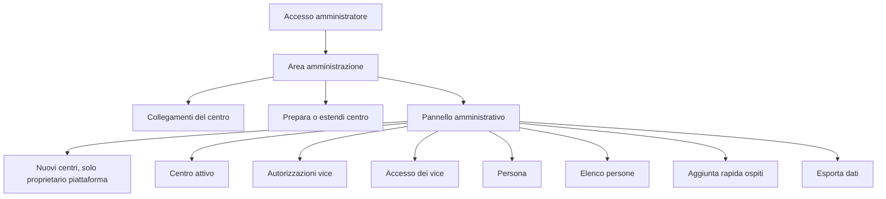
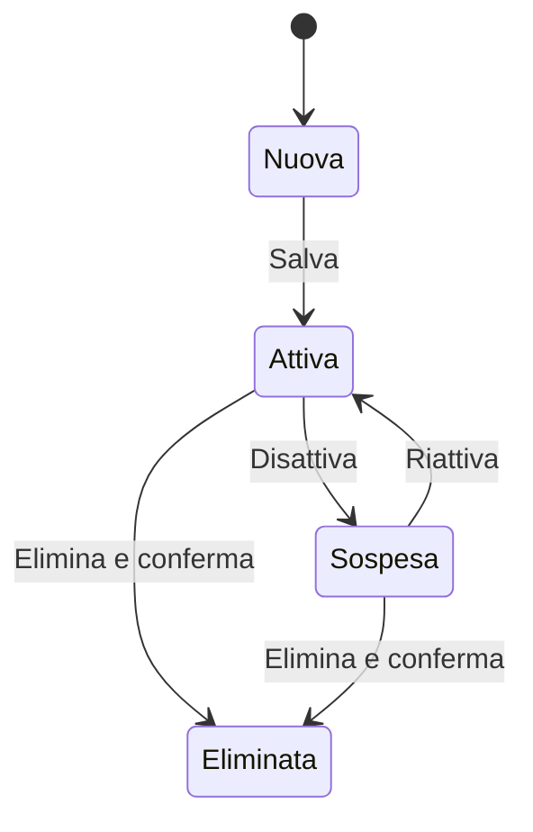
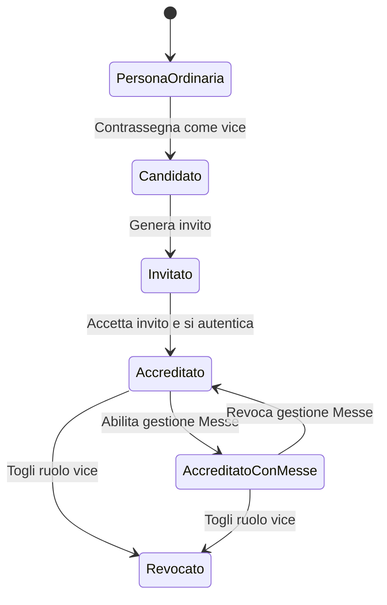

# Schema funzionale del pannello proprietario e amministratore

## Scopo del documento

Questo documento descrive il pannello di controllo di Tavola Comune come prodotto operativo, non soltanto come interfaccia. Serve come base di lavoro per una revisione professionale di usabilita.

L'analisi distingue:

- cio che il sistema consente oggi;
- i ruoli e i relativi permessi;
- i flussi necessari per raggiungere gli obiettivi principali;
- gli stati intermedi che l'interfaccia deve rendere comprensibili;
- le lacune funzionali ancora da colmare;
- le ipotesi di riorganizzazione da validare con utenti reali.

Fonti esaminate:

- interfaccia del pannello in `public/index.html`;
- logica applicativa in `public/app.js`, `admin-center.js`, `participant-data.js` e `center-settings.js`;
- regole di autorizzazione Firestore;
- documentazione multi-centro e verifica dei ruoli;
- comportamento della schermata di accesso pubblicata.

## Sintesi

Il pannello attuale contiene tre prodotti sovrapposti:

1. **Governo della piattaforma**, riservato al proprietario generale: creazione degli inviti per nuovi centri e consultazione dei centri esistenti.
2. **Amministrazione del centro**, affidata al responsabile del singolo centro: configurazione, persone, ruoli, collegamenti e manutenzione.
3. **Operativita quotidiana**, svolta soprattutto nella Vista settimana: ammalati, diete occasionali, note alla cucina e Messe.

La separazione tecnica dei dati tra i centri e gia presente. Il principale tema di usabilita non e quindi la sicurezza multi-centro, ma la comprensione di chi puo fare cosa, in quale schermata e in quale ordine.

Il modello mentale da sostenere dovrebbe essere:

```text
Proprietario piattaforma -> abilita un nuovo centro
Responsabile del centro -> configura il centro e le persone
Vice amministratore -> collabora alla gestione ordinaria
Responsabile liturgico -> gestisce soltanto le Messe
Partecipante -> prenota i propri pasti
```

## Mandato proposto al professionista UX

Il professionista non riceve il compito di ridisegnare liberamente un pannello generico. Il mandato e:

1. verificare che ruoli, funzioni e stati descritti siano comprensibili a persone non tecniche;
2. proporre un'architettura informativa che separi piattaforma, centro, persone, accessi e attivita quotidiane;
3. semplificare i flussi F01-F14 senza perdere funzioni;
4. progettare gli stati vuoto, caricamento, successo, errore, scadenza e permesso insufficiente;
5. produrre wireframe mobile, tablet e desktop;
6. definire componenti e terminologia coerenti;
7. condurre o preparare prove di usabilita sugli scenari U1-U7;
8. consegnare una lista prioritaria di modifiche con criteri verificabili.

Vincoli di prodotto da preservare:

- utilizzo principale da smartphone, con supporto completo per tablet e desktop;
- funzionamento entro i piani gratuiti Firebase;
- separazione dei dati fra centri;
- accesso semplice per un contesto comunitario e amicale;
- operazioni frequenti collocate nella Vista settimana;
- pannello di controllo destinato soprattutto a configurazione e manutenzione;
- nessuna esposizione dei nomi nel pannello Cucina, salvo le informazioni operative autorizzate.

## Vocabolario dei ruoli

| Nome per l'utente | Nome tecnico | Ambito | Significato attuale |
|---|---|---|---|
| Proprietario della piattaforma | Bootstrap owner | Tutti i centri | Genera inviti per nuovi centri e vede l'elenco complessivo. |
| Responsabile del centro | `OWNER` | Un centro | Primo amministratore creato con il centro. Ha tutti i poteri del centro. |
| Amministratore | `ADMIN` | Un centro | Ruolo previsto da codice e regole, equivalente al responsabile per la gestione dei ruoli, ma senza un flusso visibile di nomina. |
| Vice amministratore | `MANAGER` | Un centro | Gestisce persone e operativita quotidiana. Non puo nominare altri vice. La gestione delle Messe e opzionale. |
| Responsabile celebrazioni liturgiche | `liturgicalRole` | Un centro | Partecipante ordinario autorizzato a segnare le Messe nella Vista settimana. |
| Partecipante | Sessione personale | Un centro e una persona | Prenota esclusivamente per la propria identita. |
| Cucina | Sessione cucina | Un centro | Consulta conteggi, diete, ammalati e note senza vedere i nomi ordinari. |

### Nota terminologica

Nell'interfaccia conviene evitare che la parola "proprietario" indichi sia il proprietario dell'intera piattaforma sia il responsabile di un centro. Una terminologia possibile e:

- **Proprietario Tavola Comune** per il livello globale;
- **Responsabile del centro** per il ruolo `OWNER`;
- **Vice amministratore** per il ruolo `MANAGER`.

## Matrice dei permessi attuali

| Funzione | Proprietario piattaforma | Responsabile `OWNER` | `ADMIN` | Vice `MANAGER` | Liturgia |
|---|---:|---:|---:|---:|---:|
| Generare invito per un nuovo centro | Si | No | No | No | No |
| Vedere tutti i centri | Si | No | No | No | No |
| Modificare nome e fuso del proprio centro | Se amministratore del centro | Si | Si | Si | No |
| Salvare o rimuovere l'icona del centro | Se amministratore del centro | Si | Si | No | No |
| Preparare o estendere il calendario | Se amministratore del centro | Si | Si | Si | No |
| Copiare i collegamenti del centro | Se amministratore del centro | Si | Si | Si | No |
| Creare, modificare o sospendere persone | Se amministratore del centro | Si | Si | Si | No |
| Eliminare una persona ordinaria | Se amministratore del centro | Si | Si | Si | No |
| Nominare o revocare un vice | Se responsabile del centro | Si | Si | No | No |
| Attribuire la gestione delle Messe a un vice | Se responsabile del centro | Si | Si | No | No |
| Gestire diete permanenti e contatti | Se amministratore del centro | Si | Si | Si | No |
| Gestire ammalati, diete occasionali e note cucina | Se amministratore del centro | Si | Si | Si | No |
| Gestire le Messe | Se autorizzato | Si | Si | Solo se autorizzato | Si |
| Esportare i dati del centro | Se amministratore del centro | Si | Si | Si | No |

### Incongruenza da risolvere

Il vice vede il pannello del centro, ma il salvataggio dell'icona e consentito dalle regole soltanto a `OWNER` e `ADMIN`. L'interfaccia deve nascondere o disabilitare esplicitamente questi controlli per il vice, oppure le regole e il modello di delega devono essere modificati in modo coerente.

## Architettura attuale del pannello



### Sezioni presenti

#### Accesso e sessione

- accesso con Google;
- accesso con email e password;
- creazione dell'account soltanto in presenza di un invito valido;
- verifica dell'email per gli account con password;
- indicazione dell'account e dell'UID;
- uscita dalla sessione.

#### Collegamenti del centro

- collegamento Prenotazioni;
- collegamento Oggi a tavola;
- collegamento Cucina;
- copia diretta di ciascun collegamento.

#### Nuovi centri

Visibile soltanto al proprietario della piattaforma:

- generazione di un invito monouso per il futuro responsabile;
- copia del collegamento;
- elenco dei centri con nome, identificativo e stato.

#### Centro attivo

- identificativo del centro;
- nome;
- fuso orario;
- immagine o icona del centro;
- stato della copertura del calendario;
- salvataggio dei dati di base;
- preparazione o estensione del calendario.

#### Ruoli e accessi dei vice

- selezione di un residente candidato a vice;
- generazione di un invito riservato;
- copia del collegamento di invito;
- elenco dei vice gia accreditati;
- autorizzazione opzionale alla gestione delle Messe;
- gestione quotidiana sempre attiva per ogni vice.

#### Persona

- scelta di una persona esistente o creazione di una nuova;
- nome;
- sigla personale univoca;
- gruppo Residenti oppure Ospiti;
- dieta permanente;
- numero telefonico;
- attivazione o sospensione;
- ruolo liturgico;
- candidatura a vice;
- consenso alla chiamata;
- disponibilita WhatsApp;
- eliminazione definitiva.

#### Elenco persone

- visione compatta di nome, sigla, gruppo e stato;
- modifica rapida della dieta;
- modifica rapida dei ruoli vice e liturgia, se consentita;
- apertura della scheda completa;
- salvataggio ed eliminazione sulla singola riga;
- aggiunta rapida di Ospite 1, 2, 3, 4 o di un altro numero.

#### Dati

- esportazione in formato JSON dei dati del centro.

## Perimetro funzionale e stato di realizzazione

| Codice | Funzione | Stato | Osservazione |
|---|---|---|---|
| P01 | Accesso amministratore con Google | Esistente | Disponibile per proprietario, responsabile e vice accreditati. |
| P02 | Accesso con email e password verificata | Esistente | La creazione account compare quando il collegamento contiene un invito. |
| P03 | Generazione invito per un nuovo centro | Esistente | Riservata al proprietario della piattaforma; invito monouso di 30 giorni. |
| P04 | Elenco globale dei centri | Parziale | Mostra i centri, ma non offre ricerca, dettaglio operativo o azioni di assistenza. |
| C01 | Inizializzazione autonoma di un centro | Esistente | Crea centro, responsabile, dati iniziali, calendario e collegamenti. |
| C02 | Modifica di nome e fuso orario | Esistente | Consentita oggi a tutti gli amministratori attivi, incluso il vice. |
| C03 | Gestione dell'icona del centro | Esistente con incoerenza | Le regole la riservano a `OWNER` e `ADMIN`, ma i controlli sono visibili anche al vice. |
| C04 | Controllo ed estensione del calendario | Esistente | Mostra la copertura e segnala quando restano meno di 45 giorni. |
| C05 | Configurazione degli orari limite | Mancante | Gli orari esistono nel modello dati, ma non sono modificabili dal pannello. |
| C06 | Copia dei collegamenti operativi | Esistente | Prenotazioni, riepilogo e cucina sono specifici del centro. |
| C07 | Rigenerazione o revoca dei collegamenti | Mancante | Non e esposto il ciclo di vita dei collegamenti. |
| R01 | Creazione e modifica delle persone | Esistente | Comprende sigla, gruppo, dieta, telefono, consensi e stato. |
| R02 | Sospensione e riattivazione | Esistente | L'etichetta attuale "Sigla attiva" non descrive bene l'effetto. |
| R03 | Eliminazione definitiva | Esistente | Elimina anche prenotazioni e sessioni collegate, previa conferma. |
| R04 | Aggiunta rapida di ospiti numerati | Esistente | Preimpostati 1-4 e numero personalizzato fino a 999. |
| R05 | Dieta permanente | Esistente | Gestita nella persona. La dieta occasionale e nella Vista settimana. |
| R06 | Condivisione interna dei contatti | Esistente ma mal collocata | E un'impostazione globale del centro inserita nella scheda Persona. |
| A01 | Candidatura di un residente a vice | Esistente | Primo passaggio nella scheda Persona. |
| A02 | Invito e accreditamento del vice | Esistente | Secondo passaggio in una sezione separata; massimo due vice. |
| A03 | Revoca del vice | Esistente | La deselezione disabilita l'accesso amministrativo collegato. |
| A04 | Permesso Messe per un vice | Esistente | Opzionale; la gestione quotidiana e sempre inclusa. |
| A05 | Ruolo liturgico senza amministrazione | Esistente | Attribuito alla persona e usato nella Vista settimana. |
| A06 | Nomina di un amministratore `ADMIN` | Mancante | Il ruolo e supportato tecnicamente ma non assegnabile dall'interfaccia. |
| A07 | Trasferimento della responsabilita `OWNER` | Mancante | Necessario per successione e continuita del centro. |
| D01 | Esportazione dei dati | Esistente | Produce un file JSON del centro. |
| D02 | Importazione o ripristino | Mancante | Non esiste un percorso autonomo di recupero dal file esportato. |

## Oggetti e stati che l'interfaccia deve rendere visibili

### Stato di una persona



L'etichetta attuale **Sigla attiva** non descrive correttamente questo stato. La scelta non attiva o disattiva soltanto la sigla, ma l'intera possibilita della persona di partecipare e prenotare. Una denominazione piu chiara e **Persona attiva** oppure **Abilitata alle prenotazioni**.

### Stato di un vice amministratore



Oggi il processo e distribuito fra la scheda Persona, Accesso dei vice e Autorizzazioni vice. L'interfaccia non espone con sufficiente chiarezza gli stati **candidato**, **invito generato**, **invito scaduto**, **accreditato** e **revocato**.

### Stato della copertura calendario

- non configurato;
- coperto per un periodo sufficiente;
- da estendere quando restano meno di 45 giorni;
- preparazione in corso;
- completato;
- errore con possibilita di riprovare.

## Flussi principali

### F01 - Creare un nuovo centro

**Attore iniziale:** proprietario della piattaforma.

**Obiettivo:** permettere a un nuovo direttore di creare e amministrare un centro separato.

**Flusso attuale:**

1. Il proprietario accede all'Area amministrazione.
2. Apre Nuovi centri.
3. Seleziona Genera invito.
4. Il sistema crea un collegamento monouso valido 30 giorni.
5. Il proprietario copia e invia il collegamento al direttore.
6. Il direttore apre il collegamento.
7. Accede con Google oppure crea un account email e password.
8. Se usa email e password, conferma l'indirizzo email.
9. Inserisce nome del centro e fuso orario.
10. Seleziona Crea nuovo centro.
11. Il sistema crea il centro, assegna il ruolo `OWNER`, consuma l'invito e prepara calendario e collegamenti.
12. Il direttore entra nel pannello del proprio centro.

**Esito atteso:** il nuovo responsabile vede soltanto il proprio centro e dispone dei tre collegamenti da distribuire.

**Punti da verificare con gli utenti:**

- il direttore comprende che l'invito crea il suo centro e non un semplice account?
- la distinzione tra Accedi e Crea account e evidente?
- la verifica email e spiegata nel momento giusto?
- l'attesa durante la preparazione trasmette avanzamento e affidabilita?

### F02 - Configurare il centro e distribuire i collegamenti

**Attore:** responsabile del centro.

1. Controlla nome e fuso orario.
2. Inserisce facoltativamente l'icona del centro.
3. Verifica la copertura calendario.
4. Salva le impostazioni.
5. Copia i collegamenti Prenotazioni, Oggi a tavola e Cucina.
6. Invia ciascun collegamento al pubblico corretto.

**Esito atteso:** ogni destinatario accede alla funzione corretta del centro corretto.

**Lacuna attuale:** non esiste una gestione esplicita del ciclo di vita dei collegamenti, per esempio data di creazione, rigenerazione, revoca o sostituzione in caso di diffusione indesiderata.

### F03 - Preparare o estendere il calendario

**Attore:** amministratore attivo del centro.

1. Legge lo stato di copertura.
2. Se necessario seleziona Prepara / estendi centro.
3. Conferma l'operazione.
4. Vede il messaggio di attesa e l'avanzamento.
5. Il sistema aggiunge soltanto il periodo mancante e aggiorna i collegamenti tecnici.
6. Il pannello comunica la nuova data di copertura.

**Esito atteso:** calendario disponibile senza duplicazioni e senza che l'utente debba comprendere i dettagli Firestore.

### F04 - Aggiungere un residente

**Attore:** responsabile, amministratore o vice.

1. Seleziona Nuova persona.
2. Inserisce nome e sigla univoca.
3. Lascia il gruppo Residenti.
4. Lascia Nessuna dieta oppure sceglie una dieta permanente.
5. Inserisce facoltativamente telefono e consensi.
6. Lascia Persona attiva.
7. Attribuisce eventuali ruoli, se autorizzato.
8. Salva.
9. Il sistema crea la persona pubblica e privata e la regola di prenotazione, con presupposto iniziale Assente.

**Esito atteso:** la persona puo autenticarsi con la propria sigla e prenotare.

### F05 - Modificare, sospendere o riattivare una persona

**Attore:** responsabile, amministratore o vice.

1. Cerca o seleziona la persona.
2. Apre la scheda completa oppure usa la riga compatta.
3. Modifica dati, dieta, contatti o stato.
4. Salva.
5. Il sistema sincronizza scheda e riga dell'elenco.

**Esito atteso:** la modifica e visibile in entrambi i punti senza bisogno di ricaricare.

**Rischio UX:** la stessa persona e modificabile in due superfici diverse. Questo aumenta la velocita per gli utenti esperti, ma rende piu difficile capire quale sia il punto principale e puo generare stati visivi non sincronizzati.

### F06 - Eliminare definitivamente una persona

**Attore:** amministratore attivo; un vice non puo eliminare un altro vice.

1. Apre la persona o la relativa riga.
2. Seleziona Elimina persona.
3. Legge una conferma esplicita sull'irreversibilita.
4. Conferma.
5. Il sistema elimina profilo pubblico e privato, regola, prenotazioni e sessioni collegate.
6. Se la persona era un vice, il responsabile revoca prima l'accesso amministrativo.

**Esito atteso:** la persona non compare piu e non puo accedere.

**Decisione da validare:** per ridurre errori, valutare se chiedere di digitare il nome prima della cancellazione oppure offrire prima la sospensione come azione raccomandata.

### F07 - Gestire dieta permanente e dieta occasionale

**Dieta permanente:** viene assegnata nella scheda Persona e resta valida finche non viene cambiata.

Valori attuali:

- Nessuna dieta;
- Dieta 1, 2, 3, 4;
- altro numero da 5 a 999;
- In bianco;
- Diabete;
- Iposodica;
- Cardiologica.

**Dieta occasionale:** viene assegnata nella Vista settimana per uno specifico giorno e non appartiene al pannello amministrativo.

**Esito atteso:** il personale distingue senza ambiguita il regime stabile dall'eccezione giornaliera.

### F08 - Inserire un ospite ricorrente o numerato

**Attore:** responsabile, amministratore o vice.

1. Nell'Elenco persone sceglie Ospite 1, 2, 3, 4 oppure Altro numero.
2. Se necessario inserisce il numero.
3. Seleziona Aggiungi ospite.
4. Il sistema crea un ospite attivo con sigla `OSP` seguita dal numero, oppure apre quello gia esistente.
5. L'amministratore puo poi completarne dieta e contatti.

**Esito atteso:** aggiunta rapida senza compilare ogni volta tutti i dati.

### F09 - Nominare e accreditare un vice

**Attore:** responsabile `OWNER` o amministratore `ADMIN`.

1. Apre la scheda di un residente attivo.
2. seleziona Vice amministratore e salva.
3. Passa alla sezione Accesso dei vice.
4. Seleziona il residente candidato.
5. Genera l'invito riservato.
6. Copia e invia il collegamento.
7. Il candidato apre il collegamento e si autentica con Google oppure email verificata.
8. Il sistema consuma l'invito e crea l'accesso `MANAGER`.
9. Il responsabile vede il vice fra gli accreditati.
10. Facoltativamente abilita Gestione Messe.

**Vincoli:** massimo due vice attivi per centro; invito monouso valido 30 giorni.

**Esito atteso:** il vice gestisce sempre persone, cucina, ammalati e diete occasionali; gestisce le Messe soltanto se autorizzato.

**Miglioramento prioritario:** trasformare il flusso in una procedura guidata unica che mostri chiaramente i passi completati e quelli mancanti.

### F10 - Revocare un vice

**Attore:** responsabile `OWNER` o amministratore `ADMIN`.

1. Apre la scheda della persona.
2. Deseleziona Vice amministratore.
3. Salva.
4. Il sistema disabilita anche l'account amministrativo collegato.
5. La persona resta un partecipante ordinario, salvo diversa scelta sullo stato.

**Esito atteso:** revoca immediata e comprensibile, senza eliminare la persona.

### F11 - Assegnare la gestione liturgica

**Caso partecipante ordinario:** il responsabile seleziona Celebrazioni liturgiche nella scheda Persona. La persona ottiene nella Vista settimana soltanto i controlli delle Messe.

**Caso vice:** la gestione quotidiana e sempre inclusa; il responsabile abilita separatamente Gestione Messe nella sezione Autorizzazioni vice.

**Rischio UX:** due controlli con nomi diversi governano una capacita simile in due tipi di account. L'interfaccia dovrebbe spiegare perche i percorsi sono differenti.

### F12 - Gestire le attivita quotidiane

Queste funzioni appartengono al lavoro amministrativo, ma sono correttamente collocate nella Vista settimana, perche usate spesso:

- indicare ammalati;
- assegnare diete occasionali;
- scrivere una nota per la cucina;
- indicare la presenza della Messa;
- correggere prenotazioni quando consentito.

Il pannello di controllo dovrebbe offrire un collegamento chiaro a **Gestione della settimana**, ma non duplicare questi strumenti.

### F13 - Esportare i dati

**Attore:** amministratore attivo.

1. Seleziona Esporta dati.
2. Conferma.
3. Il sistema legge le raccolte del centro.
4. Scarica un file JSON e comunica il numero di documenti esportati.

**Lacuna attuale:** non esiste un flusso visibile di importazione o ripristino. L'utente potrebbe interpretare Esporta dati come un backup completo anche se non dispone di un comando autonomo per ripristinarlo.

### F14 - Trasferire la responsabilita del centro

**Stato:** non implementato nell'interfaccia corrente.

Questo flusso e necessario per la continuita operativa.

**Flusso proposto:**

1. Il responsabile apre Ruoli e accessi.
2. Seleziona Trasferisci responsabilita.
3. Sceglie una persona gia accreditata e con identita verificata.
4. Il sistema mostra con chiarezza i poteri che verranno trasferiti.
5. Il responsabile si riautentica.
6. Digita una conferma esplicita.
7. Il sistema esegue atomicamente il passaggio del ruolo `OWNER`.
8. Il precedente responsabile diventa `ADMIN`, `MANAGER` oppure perde l'accesso, secondo la scelta effettuata.
9. Entrambi ricevono una conferma visibile.

**Vincoli consigliati:** deve esistere sempre un solo responsabile attivo; il trasferimento non deve poter lasciare il centro senza proprietario; deve essere previsto un recupero da parte del proprietario della piattaforma.

## Lacune funzionali da sottoporre al professionista e allo sviluppo

### Priorita alta

1. **Successione del responsabile assente.** Il ruolo `OWNER` nasce con il centro, ma non esiste una funzione visibile per trasferirlo.
2. **Ruolo `ADMIN` non assegnabile dall'interfaccia.** E previsto da codice e regole ma non esiste un flusso di promozione o revoca.
3. **Ciclo di vita del vice poco leggibile.** Candidatura, invito e account accreditato sono separati e non presentati come un unico processo.
4. **Permessi visibili non sempre coerenti.** Il vice puo vedere controlli, come quelli dell'icona, che le regole non gli consentono di usare.
5. **Impostazione globale dei contatti collocata nella Persona.** "Mostra i contatti nel riepilogo interno" modifica il comportamento dell'intero centro, non della persona selezionata.
6. **Orari limite non configurabili dal pannello.** Il modello dati contiene gli orari di chiusura, ma l'interfaccia non offre ancora il controllo richiesto all'amministratore.

### Priorita media

1. **Doppia modifica delle persone.** Scheda completa ed Elenco persone competono come punto principale.
2. **Pagina molto lunga su mobile.** Le sezioni richiedono molto scorrimento e non esiste una navigazione locale persistente.
3. **Azioni globali e locali mescolate.** Nuovi centri, Centro attivo e Persone condividono la stessa pagina.
4. **Collegamenti senza gestione.** Mancano data, stato, rigenerazione e revoca.
5. **Esportazione senza ripristino.** Il valore operativo del file non e spiegato.
6. **Elenco globale dei centri essenziale.** Mancano ricerca, filtri, apertura del centro, stato operativo e azioni di assistenza.

### Priorita bassa

1. Rendere piu riconoscibili gli stati Salvato, Non salvato, In corso ed Errore.
2. Consolidare il linguaggio: persona, residente, ospite, amministratore, responsabile e vice.
3. Verificare la gestione del focus dopo salvataggio, eliminazione e creazione di un ospite.
4. Rendere esplicita la differenza tra sospendere ed eliminare.

## Ipotesi di nuova architettura informativa

Il professionista dovrebbe valutare una struttura per obiettivi, non per campi tecnici.

### Livello piattaforma

Visibile soltanto al proprietario generale:

- **Centri**: elenco, ricerca, stato e apertura;
- **Nuovo centro**: generazione e stato degli inviti;
- **Assistenza**: recupero del responsabile e controllo della continuita.

### Livello centro

1. **Panoramica**
   - nome del centro;
   - stato calendario;
   - numero di residenti, ospiti e amministratori;
   - azioni che richiedono attenzione.
2. **Persone**
   - elenco, ricerca e filtri;
   - creazione e scheda di dettaglio;
   - sospensione ed eliminazione;
   - dieta permanente e contatti.
3. **Ruoli e accessi**
   - responsabile;
   - amministratori;
   - vice;
   - liturgia;
   - inviti e relativi stati;
   - trasferimento della responsabilita.
4. **Collegamenti**
   - Prenotazioni;
   - Oggi a tavola;
   - Cucina;
   - copia, stato, rigenerazione e revoca.
5. **Centro e calendario**
   - nome, fuso e icona;
   - orari limite;
   - copertura del calendario;
   - preparazione ed estensione.
6. **Dati**
   - esportazione;
   - spiegazione del contenuto;
   - eventuale ripristino amministrato.

### Accesso alle operazioni quotidiane

Una voce separata **Gestione settimana** dovrebbe portare a Messe, ammalati, diete occasionali e nota cucina. Non dovrebbe essere necessario aprire o attraversare il pannello di configurazione.

## Principi UX da validare

1. **Mostrare soltanto cio che il ruolo puo usare.** Un controllo visibile ma non autorizzato genera sfiducia.
2. **Una sola azione primaria per sezione.** Salva centro, Salva persona e Genera invito devono avere contesti distinti.
3. **Rendere visibili gli stati intermedi.** Gli inviti devono mostrare destinatario, scadenza, stato e uso.
4. **Separare azioni reversibili e irreversibili.** Sospendi e Elimina non devono avere lo stesso peso.
5. **Usare divulgazione progressiva.** Su mobile mostrare prima elenco e stato, poi i dettagli necessari.
6. **Evitare impostazioni globali dentro oggetti locali.** Le preferenze del centro devono stare in Centro.
7. **Ridurre la memoria richiesta all'utente.** Il sistema deve ricordare e mostrare a che punto e la nomina di un vice.
8. **Confermare l'esito, non soltanto l'avvio.** Dopo ogni salvataggio deve risultare evidente cosa e cambiato.
9. **Preservare la continuita.** Il cambio del responsabile deve essere progettato come funzione ordinaria, non come intervento tecnico eccezionale.

## Scenari per una prova di usabilita

### Scenario U1 - Creazione di un centro

Consegna al partecipante un invito e chiedigli di creare il centro "Torrescalla", prepararlo e trovare i tre collegamenti da distribuire.

Misurare:

- completamento senza aiuto;
- tempo totale;
- esitazioni tra accesso e creazione account;
- comprensione dei tre collegamenti.

### Scenario U2 - Inserimento di cinque residenti da smartphone

Chiedere di inserire cinque persone, una con telefono e WhatsApp, una con Dieta 3 e una con ruolo liturgico.

Misurare:

- tempo medio per persona;
- errori sulla sigla;
- numero di ritorni fra elenco e scheda;
- percezione del salvataggio riuscito.

### Scenario U3 - Sospensione e riattivazione

Chiedere di impedire temporaneamente a un residente di prenotare senza cancellarne i dati, quindi di riattivarlo.

Misurare:

- scelta corretta fra sospensione ed eliminazione;
- comprensione dell'etichetta dello stato;
- capacita di ritrovare una persona sospesa.

### Scenario U4 - Nomina di un vice

Chiedere di nominare Lucia vice, inviarle l'accesso e abilitarla anche alle Messe.

Misurare:

- scoperta del doppio passaggio;
- comprensione dello stato dell'invito;
- capacita di verificare che Lucia sia davvero accreditata;
- errori nel confondere ruolo vice e ruolo liturgico.

### Scenario U5 - Gestione di un ospite

Chiedere di creare Ospite 7 e assegnargli una dieta.

Misurare:

- comprensione dell'aggiunta rapida;
- scoperta della successiva modifica nella scheda;
- duplicazioni involontarie.

### Scenario U6 - Continuita amministrativa

Chiedere al responsabile uscente di lasciare la gestione al successore senza perdere i dati del centro.

Questo scenario oggi non e completabile. Serve a verificare il modello mentale e a progettare F14.

### Scenario U7 - Operativita quotidiana

Chiedere a un vice di indicare un ammalato, una dieta occasionale e una nota per la cucina.

Misurare:

- se cerca queste funzioni nel pannello o nella Vista settimana;
- tempo per raggiungere l'area corretta;
- comprensione della differenza fra dieta permanente e occasionale.

## Indicatori di successo suggeriti

| Obiettivo | Indicatore |
|---|---|
| Creare un centro | Almeno 90% di completamento senza assistenza. |
| Aggiungere una persona | Meno di 60 secondi dopo il primo inserimento. |
| Nominare un vice | Nessun partecipante deve credere che la sola casella Vice completi l'accreditamento. |
| Sospendere una persona | Almeno 95% sceglie Sospendi e non Elimina. |
| Trovare un collegamento | Meno di 15 secondi. |
| Individuare un problema | Calendario in scadenza e inviti incompleti riconosciuti in meno di 10 secondi. |
| Uso mobile | Tutte le azioni principali completabili con una mano e senza scorrimenti laterali. |
| Feedback | Dopo ogni azione l'utente sa dire cosa e stato salvato e cosa no. |

## Domande da porre al professionista

1. Il pannello deve aprirsi su una panoramica oppure direttamente sull'elenco persone?
2. Persone e ruoli devono essere pagine separate o due viste dello stesso elenco?
3. Qual e la rappresentazione piu chiara del ciclo candidato, invitato, accreditato e revocato?
4. La modifica rapida nell'elenco produce un vantaggio sufficiente a giustificare la duplicazione con la scheda completa?
5. Come rendere immediatamente distinguibili impostazioni del centro, dati della persona e operazioni giornaliere?
6. Quale navigazione mobile riduce meglio la pagina lunga: schede, menu, sezioni richiudibili o pagine distinte?
7. Come presentare la successione del responsabile senza rendere troppo facile un trasferimento accidentale?
8. Come comunicare il valore e i limiti dell'esportazione dei dati?
9. Quali informazioni del centro devono essere visibili al proprietario della piattaforma senza invadere la gestione locale?
10. Quale terminologia e compresa meglio dal pubblico reale: responsabile, amministratore, vice, incaricato liturgia?

## Decisioni di prodotto da prendere

Prima del restyling definitivo occorre decidere:

1. se il ruolo `ADMIN` deve diventare un ruolo realmente nominabile oppure essere eliminato dal modello pubblico;
2. quale ruolo assume il responsabile uscente dopo il trasferimento;
3. se un vice puo modificare nome, fuso e collegamenti del centro;
4. se un vice puo esportare tutti i dati;
5. chi puo rigenerare o revocare i collegamenti operativi;
6. chi puo modificare gli orari limite;
7. se il file esportato e soltanto un archivio o deve poter essere ripristinato;
8. se la gestione contatti e una scelta globale del centro o anche individuale;
9. per quanto tempo conservare inviti scaduti, persone sospese e dati storici.

## Definizione di completamento del futuro pannello

Il pannello potra considerarsi maturo quando:

- ogni ruolo vede soltanto funzioni utilizzabili;
- il proprietario della piattaforma crea un nuovo centro senza interventi tecnici;
- il responsabile configura il centro e distribuisce i collegamenti senza conoscere Firebase;
- una persona viene creata, sospesa, riattivata o eliminata da mobile senza ambiguita;
- la nomina di un vice e presentata come un processo unico e verificabile;
- il trasferimento della responsabilita e disponibile e sicuro;
- le impostazioni globali non sono confuse con i dati della singola persona;
- le attivita quotidiane restano raggiungibili dalla Vista settimana;
- tutti gli stati importanti sono leggibili senza dover aggiornare manualmente la pagina;
- i flussi U1-U7 raggiungono gli indicatori di successo concordati.
